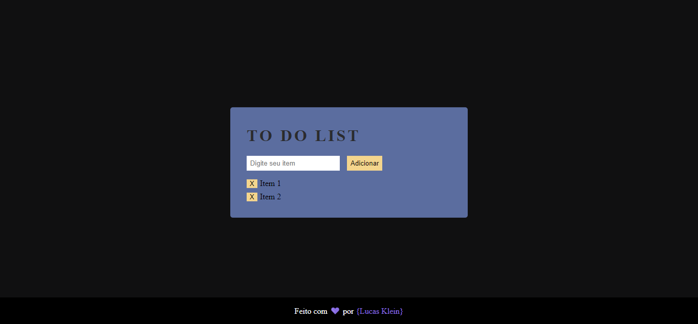

<h1 align="center"> To Do List</h1>

Projeto desenvolvido durante o Hiring coders da VTEX com Gama Academy

📖 - Projeto desenvolvido durante o Hiring coders da VTEX com Gama Academy, com o intúito de desenvolver uma To Do List básica em Java Script

<h2>🚀 Tecnologias utilizadas: </h2>

- HTML
- CSS
- JavaScript

<h2>Para iniciar o projeto use: </h2>
git clone https://github.com/olucasklein/gama-todolist.git

<h2>Para iniciar a Landing Page:</h2>
Recomendo a utilização da extensão Live Server no VSCode

<h2>📝 Licença</h2>
Esse projeto está sob a licença MIT. Veja o arquivo LICENSE para mais detalhes.
